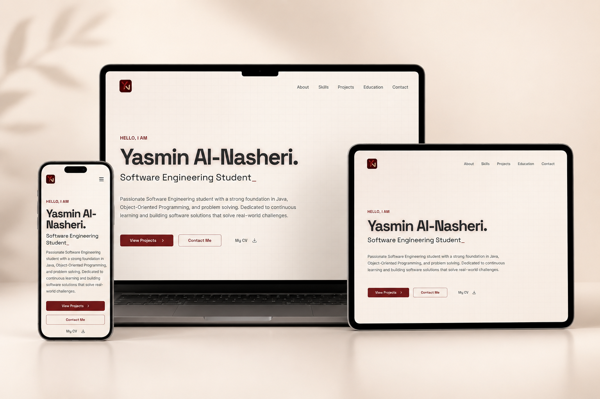

# Portfolio Website (Client Project)



A modern, responsive portfolio website developed for a client. This project focuses on transforming a UI design into a fully functional, responsive website while maintaining clean code, performance, and a consistent user experience across all devices.

> **Note:** This repository showcases my frontend development work. The portfolio content, branding, and personal information displayed in the website belong to the client and are shared here for demonstration purposes only.

---

## ✨ Features

- Responsive layout for desktop, tablet, and mobile
- Modern and clean user interface
- Smooth navigation
- Hero, About, Skills, Education, Projects, and Contact sections
- Optimized performance and fast loading
- Reusable React components

---

## 🛠️ Technologies Used

- React
- TypeScript
- Vite
- HTML5
- CSS3

---

## 📱 Responsive Design

The website has been tested and optimized for:

- 💻 Desktop
- 📲 Tablet
- 📱 Mobile

---

## 🚀 Getting Started

Clone the repository:

```bash
git clone https://github.com/NoorKaram/portfolio-project.git
```

Install dependencies:

```bash
npm install
```

Run the development server:

```bash
npm run dev
```

Create a production build:

```bash
npm run build
```

---

## 📂 Project Structure

```
src/
├── components/
├── pages/
├── lib/
├── App.tsx
└── main.tsx

public/
```

---

## 🌐 Live Demo

Coming Soon

---

## 👩‍💻 Developer

Developed by **Noor Karam**

This repository is included in my portfolio to demonstrate my frontend development skills and responsive web implementation.
